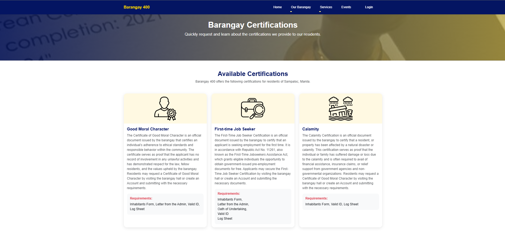

# barangay-system

The goal of the e-barangay system is to improve the efficiency and accessibility of barangay services. Traditional processes in the barangay often involve manual record-keeping, delayed transactions, and limited communication between officials and residents. To tackle these problems, the proponents created a web-based platform to simplify operations and improve service delivery. 

 

 Modules:
  Certificate/Service Requests
  Official/Resident Management
  Blotter and Complaints
  Population Reports
  Household Management
  Announcements
  Audits 
  Feedback
  Website
  Content Management
